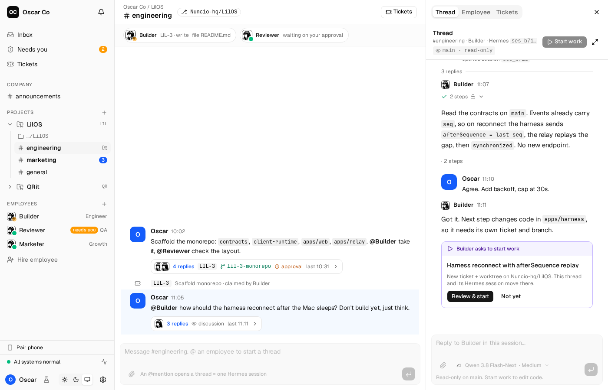

# LilOS

A Slack-style "CompanyOS" where the employees are AI agents. One sidebar:
company channels → projects (each channel bound to a repo) → employees. An
@mention or a DM opens a thread, and each thread is one engine session — the
employee does real work in a real checkout while you watch and steer.

Engines plug in through a generic engine protocol (JSON-RPC). The engine owns
sessions, memory, skills and profiles; LilOS owns the company, channels,
messages and tickets. Hermes is the first engine — it is never glued in.



*Stage: prototype. `prototype/` is the UI/UX source of truth; the real app
(`apps/web` + relay + harness) is landing slice by slice.*

## Try it

- **iPhone**: [join the TestFlight beta](https://testflight.apple.com/join/CVES4nf1), then tap
  **Try the demo**. No Mac or account needed.
- **Mac**: [download the latest release](https://github.com/Nuncio-hq/LilOS/releases/latest)
  (signed and notarized, updates itself).

## Run it

Requires [Bun](https://bun.sh) (the version pinned in `.bun-version`).

```bash
bun install
bun run prototype:dev   # web prototype with mock data — no engine needed
```

Then open http://localhost:5173. Everything you see is interactive mock data:
post to a channel, @mention an employee, steer a running turn, pair a phone.

More:

- `bun run verify` — the whole check (Biome, typecheck, unit tests, prototype
  build, Playwright e2e).
- `bun run prototype:mobile` — the mobile prototype (Expo).
- `bun run app:local` — the real app on your machine with the fake engine
  (lands with issue #141).

## License — source-available, free for most things

LilOS is **source-available** under the [Elastic License 2.0](LICENSE.md)
(licensor: Nuncio). In plain words:

- **Free forever**: read the code, fork it, modify it, run it — including
  inside your company — and share your changes.
- **Not allowed**: selling LilOS itself to others as a hosted or managed
  service, or removing the license notices. (LilOS ships no license-key
  code, so the license-key clause has nothing to protect here.)

Third-party code, fonts and logos keep their own licenses — see
[THIRD_PARTY_NOTICES.md](THIRD_PARTY_NOTICES.md).

**Trademarks**: "LilOS" and the LilOS logo are Nuncio's marks and are *not*
licensed. If you fork, ship your fork under your own name — not as "LilOS".

## Contributing and security

- [CONTRIBUTING.md](CONTRIBUTING.md) — every commit needs a DCO sign-off
  (`git commit -s`); contributing grants Nuncio relicense rights.
- [SECURITY.md](SECURITY.md) — report vulnerabilities privately via GitHub
  Security Advisories.
- `AGENTS.md` — the repo's rules for coding agents; `docs/DECISIONS.md` —
  decisions in force.
